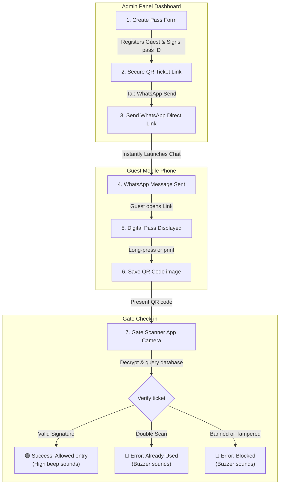

# Club Nirvana Ticketing & Scanner System - Complete Guide & Code Overview

Welcome! This document outlines how the custom ticketing and gate scanner system works for **Club Nirvana, Jodhpur** (featuring the event **VANGUARD // NOTHING**). It is designed to explain everything from scratch (0 to Hero) in plain, simple terms, followed by the raw code files for the core system logic.

---

## 🗺️ Ticket Flow & Scanning Process Diagram

This diagram visualizes how a ticket travels from your admin panel to the guest, and finally to the security guards at the door:



---

## 🎟️ How the System Works (0 to Hero Guide)

This platform is a private, custom-built system that runs completely in the cloud. It handles guest management, pass creation, secure scanning at the entrance gate, and works even if the gate loses internet connection. 

Here is the step-by-step breakdown:

### Step 1: Creating a Pass (The Admin Panel)
* **The Dashboard**: As an administrator, you have a private screen where you can add guests. You type in their name, phone number, email, and choose their pass type (e.g., VIP, Regular, Couple).
* **Cryptographic Signing**: The moment you click "Create Ticket", the system creates a secure token. This token acts like a digital wax seal. It encodes the guest's ticket details and signs it using a secret password known only to the server. If anyone tries to copy the ticket or edit their pass type (like changing a "Regular" pass to "VIP"), the system will instantly reject it as tampered.
* **Instant WhatsApp Send**: Once created, a green "Send on WhatsApp" button appears. Clicking it launches WhatsApp on your phone or computer with a pre-written message and the pass link already typed out. You just hit "Send".

### Step 2: The Guest Experience (The Pass Card)
* **The Ticket Link**: The guest receives a link (e.g., `https://club-nirvana.vercel.app/?ticket=...`).
* **The Pass Display**: When they open this link, they see a luxury, black-and-gold digital pass card displaying their name, ticket type, the venue (Club Nirvana, Jodhpur), and their unique secure QR code.
* **Easy Saving**: Guests can tap "Share / Save" on their phone to download the pass image to their photos or WhatsApp it to their partner.

### Step 3: Scanning at the Gate (The Scanner App)
* **Staff Login**: Security guards or check-in staff log in at the gate using their phones with an access code (e.g., `gate123` for scanners, or `admin8824` for full admin access).
* **Start Scanner**: They tap "Start Camera", grant camera access, and point their phone at the guest's QR code.
* **Full-Screen Results**: To make check-ins fast under loud music and dark club lighting, the scanner uses full-screen colored screens:
  * **GREEN (Entry Allowed)**: The ticket is valid. The screen displays the guest's name and ticket type in large text. A high-pitched double-beep sounds.
  * **RED (Already Checked In)**: The ticket has already been scanned. It displays the exact time it was first checked in to prevent people from sharing screenshots of a single ticket to get multiple people in. A buzzer sound plays.
  * **RED (Banned)**: The guest has been blacklisted on the admin panel.
  * **RED (Invalid)**: The QR code is fake or corrupted.

### Step 4: The Offline Safeguard (IndexedDB Caching)
* **The Problem**: Gate entrances often have poor mobile network reception.
* **The Solution**: Before the gates open, staff tap **"Download Cache"** in the scanner dashboard. This downloads a list of all valid ticket IDs directly to the local storage of the scanner phone.
* **Offline Scanning**: If the internet goes down, the camera keeps scanning. It checks the local phone storage to verify passes and logs check-ins. If someone tries to scan the same pass twice offline, the phone detects it and blocks it.
* **Auto-Syncing**: Once internet connection returns, tapping **"Force DB Sync"** uploads all offline scans back to your central cloud database automatically.

### Step 5: Managing the Event (Attendee Directory)
* **Directory**: You have a central spreadsheet-like directory displaying everyone who has registered.
* **Controls**: You can search by name or phone, view who has entered and who is remaining, manual-check-in overrides, blacklist disruptive guests, or delete passes entirely.
* **CSV Export**: Click "Export to CSV" to instantly download the full attendee spreadsheet to open in Excel.

---

## 🗄️ Database Table Structure

These tables are created in your Postgres database to store all information securely:

```sql
CREATE EXTENSION IF NOT EXISTS "uuid-ossp";

-- Guest Profiles
CREATE TABLE public.users (
    id UUID PRIMARY KEY DEFAULT gen_random_uuid(),
    name TEXT NOT NULL,
    phone TEXT NOT NULL,
    email TEXT NOT NULL,
    age INTEGER NOT NULL,
    gender TEXT NOT NULL,
    instagram TEXT,
    created_at TIMESTAMPTZ NOT NULL DEFAULT NOW()
);

CREATE INDEX idx_users_phone ON public.users(phone);
CREATE INDEX idx_users_email ON public.users(email);

-- Active Ticket Passes
CREATE TABLE public.tickets (
    id UUID PRIMARY KEY DEFAULT gen_random_uuid(),
    user_id UUID NOT NULL REFERENCES public.users(id) ON DELETE CASCADE,
    ticket_type TEXT NOT NULL CHECK (ticket_type IN ('Regular', 'VIP', 'Couple', 'Staff', 'Guest List')),
    qr_token TEXT NOT NULL UNIQUE,
    is_used BOOLEAN NOT NULL DEFAULT FALSE,
    used_at TIMESTAMPTZ,
    is_banned BOOLEAN NOT NULL DEFAULT FALSE,
    created_at TIMESTAMPTZ NOT NULL DEFAULT NOW()
);

CREATE INDEX idx_tickets_qr_token ON public.tickets(qr_token);
CREATE INDEX idx_tickets_user_id ON public.tickets(user_id);

-- Check-in Logs
CREATE TABLE public.checkins (
    id UUID PRIMARY KEY DEFAULT gen_random_uuid(),
    ticket_id UUID NOT NULL REFERENCES public.tickets(id) ON DELETE CASCADE,
    scanner_device TEXT NOT NULL,
    gate TEXT NOT NULL,
    online_or_offline TEXT NOT NULL CHECK (online_or_offline IN ('online', 'offline')),
    timestamp TIMESTAMPTZ NOT NULL DEFAULT NOW()
);

CREATE INDEX idx_checkins_ticket_id ON public.checkins(ticket_id);
CREATE INDEX idx_checkins_timestamp ON public.checkins(timestamp);

-- Event Staff credentials
CREATE TABLE public.staff (
    id UUID PRIMARY KEY DEFAULT gen_random_uuid(),
    name TEXT NOT NULL,
    email TEXT NOT NULL UNIQUE,
    role TEXT NOT NULL CHECK (role IN ('Admin', 'Security')),
    access_code TEXT NOT NULL,
    created_at TIMESTAMPTZ NOT NULL DEFAULT NOW()
);

INSERT INTO public.staff (name, email, role, access_code)
VALUES 
('Admin User', 'admin@event.com', 'Admin', 'admin8824'),
('Gate Scanner A', 'gatea@event.com', 'Security', 'gate123')
ON CONFLICT (email) DO NOTHING;

-- Log of local scanner sync actions
CREATE TABLE public.sync_logs (
    id UUID PRIMARY KEY DEFAULT gen_random_uuid(),
    device TEXT NOT NULL,
    sync_time TIMESTAMPTZ NOT NULL DEFAULT NOW(),
    status TEXT NOT NULL CHECK (status IN ('success', 'failed', 'conflict_resolved')),
    records_synced INTEGER NOT NULL DEFAULT 0
);
```

---

## 💻 Technical Code Files

### 1. Token Signer & Verifier (`src/lib/qrCrypto.ts`)

```typescript
import jwt from 'jsonwebtoken';

const JWT_SECRET = process.env.QR_JWT_SECRET || 'fallback-secret-key-do-not-use-in-production';

export interface QRTicketPayload {
  i: string;
  n: string;
  t: string;
}

export function signQRToken(payload: QRTicketPayload): string {
  try {
    return jwt.sign(payload, JWT_SECRET);
  } catch (error) {
    console.error(error);
    throw new Error('Failed to sign QR code.');
  }
}

export function verifyQRToken(token: string): QRTicketPayload {
  try {
    return jwt.verify(token, JWT_SECRET) as QRTicketPayload;
  } catch (error) {
    console.error(error);
    throw new Error('Invalid or tampered QR code token.');
  }
}
```

### 2. Local Storage IndexedDB Cache (`src/lib/indexedDb.ts`)

```typescript
import { openDB, DBSchema, IDBPDatabase } from 'idb';

export interface OfflineTicket {
  id: string;
  user_id: string;
  name: string;
  phone: string;
  ticket_type: string;
  qr_token: string;
  is_used: boolean;
  used_at: string | null;
  is_banned: boolean;
}

export interface OfflineCheckin {
  id?: number;
  ticket_id: string;
  scanner_device: string;
  gate: string;
  online_or_offline: 'online' | 'offline';
  timestamp: string;
  synced: boolean;
}

interface EventScannerDB extends DBSchema {
  tickets: {
    key: string;
    value: OfflineTicket;
    indexes: { 'by-id': string };
  };
  checkins: {
    key: number;
    value: OfflineCheckin;
    indexes: { 'by-synced': number };
  };
}

const DB_NAME = 'event_scanner_db';
const DB_VERSION = 1;

let dbPromise: Promise<IDBPDatabase<EventScannerDB>> | null = null;

export function getDB() {
  if (typeof window === 'undefined') return null;
  if (!dbPromise) {
    dbPromise = openDB<EventScannerDB>(DB_NAME, DB_VERSION, {
      upgrade(db) {
        const ticketStore = db.createObjectStore('tickets', { keyPath: 'qr_token' });
        ticketStore.createIndex('by-id', 'id');
        const checkinStore = db.createObjectStore('checkins', { keyPath: 'id', autoIncrement: true });
        checkinStore.createIndex('by-synced', 'synced' as any);
      },
    });
  }
  return dbPromise;
}

export async function saveTicketsOffline(tickets: OfflineTicket[]): Promise<void> {
  const db = await getDB();
  if (!db) return;
  const tx = db.transaction(['tickets'], 'readwrite');
  const store = tx.objectStore('tickets');
  await store.clear();
  for (const ticket of tickets) {
    await store.put(ticket);
  }
  await tx.done;
}

export async function getCachedTicketsCount(): Promise<number> {
  const db = await getDB();
  if (!db) return 0;
  return db.count('tickets');
}

export async function getOfflineTicketByToken(qrToken: string): Promise<OfflineTicket | undefined> {
  const db = await getDB();
  if (!db) return undefined;
  return db.get('tickets', qrToken);
}

export async function logOfflineCheckin(
  ticketId: string,
  qrToken: string,
  gate: string,
  scannerDevice: string
): Promise<{ status: 'success' | 'already_used' | 'banned' | 'not_found' }> {
  const db = await getDB();
  if (!db) return { status: 'not_found' };

  const ticket = await db.get('tickets', qrToken);
  if (!ticket) {
    return { status: 'not_found' };
  }

  if (ticket.is_banned) {
    return { status: 'banned' };
  }

  if (ticket.is_used) {
    return { status: 'already_used' };
  }

  ticket.is_used = true;
  ticket.used_at = new Date().toISOString();

  const tx = db.transaction(['tickets', 'checkins'], 'readwrite');
  await tx.objectStore('tickets').put(ticket);

  const newCheckin: OfflineCheckin = {
    ticket_id: ticketId,
    scanner_device: scannerDevice,
    gate: gate,
    online_or_offline: 'offline',
    timestamp: new Date().toISOString(),
    synced: false
  };

  await tx.objectStore('checkins').add(newCheckin);
  await tx.done;

  return { status: 'success' };
}

export async function getUnsyncedCheckins(): Promise<OfflineCheckin[]> {
  const db = await getDB();
  if (!db) return [];
  const checkins = await db.getAll('checkins');
  return checkins.filter(c => !c.synced);
}

export async function markCheckinsSynced(ids: number[]): Promise<void> {
  const db = await getDB();
  if (!db) return;
  const tx = db.transaction(['checkins'], 'readwrite');
  const store = tx.objectStore('checkins');
  for (const id of ids) {
    const record = await store.get(id);
    if (record) {
      record.synced = true;
      await store.put(record);
    }
  }
  await tx.done;
}

export async function clearLocalData(): Promise<void> {
  const db = await getDB();
  if (!db) return;
  const tx = db.transaction(['tickets', 'checkins'], 'readwrite');
  await tx.objectStore('tickets').clear();
  await tx.objectStore('checkins').clear();
  await tx.done;
}
```

### 3. Sync Background Coordinator (`src/lib/syncEngine.ts`)

```typescript
import { getUnsyncedCheckins, markCheckinsSynced } from './indexedDb';

export async function syncOfflineScans(deviceName: string): Promise<{
  success: boolean;
  totalSynced: number;
  conflicts: number;
  error?: string;
}> {
  try {
    const unsynced = await getUnsyncedCheckins();
    if (unsynced.length === 0) {
      return { success: true, totalSynced: 0, conflicts: 0 };
    }

    const response = await fetch('/api/tickets/sync', {
      method: 'POST',
      headers: { 'Content-Type': 'application/json' },
      body: JSON.stringify({
        checkins: unsynced,
        device: deviceName
      })
    });

    if (!response.ok) {
      throw new Error(`Sync request failed with status: ${response.status}`);
    }

    const result = await response.json();
    if (result.success && result.syncedIds && result.syncedIds.length > 0) {
      await markCheckinsSynced(result.syncedIds);
      return {
        success: true,
        totalSynced: result.summary.successful,
        conflicts: result.summary.conflicts
      };
    }

    return { success: false, totalSynced: 0, conflicts: 0, error: 'Server returned failure sync state' };

  } catch (error: any) {
    console.error(error);
    return {
      success: false,
      totalSynced: 0,
      conflicts: 0,
      error: error.message || 'Unknown network error'
    };
  }
}
```

### 4. Ticket Pass Generator endpoint (`src/app/api/tickets/create/route.ts`)

```typescript
import { NextResponse } from 'next/server';
import { supabaseAdmin } from '@/lib/supabaseAdmin';
import { signQRToken } from '@/lib/qrCrypto';

export async function POST(request: Request) {
  try {
    const body = await request.json();
    const { name, phone, email, age, gender, instagram, ticket_type } = body;

    if (!name || !phone || !email || !age || !gender || !ticket_type) {
      return NextResponse.json(
        { error: 'Missing required fields' },
        { status: 400 }
      );
    }

    const { data: existingUser, error: searchError } = await supabaseAdmin
      .from('users')
      .select('id')
      .eq('phone', phone)
      .maybeSingle();

    if (searchError) {
      console.error(searchError);
      return NextResponse.json({ error: 'Database search failed' }, { status: 500 });
    }

    let userId = existingUser?.id;

    if (userId) {
      const { data: existingTicket, error: ticketCheckError } = await supabaseAdmin
        .from('tickets')
        .select('id')
        .eq('user_id', userId)
        .maybeSingle();

      if (ticketCheckError) {
        console.error(ticketCheckError);
        return NextResponse.json({ error: 'Database verification failed' }, { status: 500 });
      }

      if (existingTicket) {
        return NextResponse.json(
          { error: 'This guest (phone number) already has an active ticket generated!' },
          { status: 400 }
        );
      }
    }

    if (!userId) {
      const { data: newUser, error: createError } = await supabaseAdmin
        .from('users')
        .insert({
          name,
          phone,
          email,
          age: parseInt(age, 10),
          gender,
          instagram: instagram || null
        })
        .select('id')
        .single();

      if (createError || !newUser) {
        console.error(createError);
        return NextResponse.json({ error: 'Failed to create guest user profile' }, { status: 500 });
      }

      userId = newUser.id;
    }

    const { data: tempTicket, error: ticketError } = await supabaseAdmin
      .from('tickets')
      .insert({
        user_id: userId,
        ticket_type,
        qr_token: `TEMP_${Date.now()}_${Math.random().toString(36).substring(2, 7)}`,
        is_used: false,
        is_banned: false
      })
      .select('id, created_at')
      .single();

    if (ticketError || !tempTicket) {
      console.error(ticketError);
      return NextResponse.json({ error: 'Failed to generate ticket' }, { status: 500 });
    }

    const ticketId = tempTicket.id;

    const qrToken = signQRToken({
      i: ticketId,
      n: name,
      t: ticket_type
    });

    const { data: finalTicket, error: updateError } = await supabaseAdmin
      .from('tickets')
      .update({ qr_token: qrToken })
      .eq('id', ticketId)
      .select('*')
      .single();

    if (updateError || !finalTicket) {
      console.error(updateError);
      return NextResponse.json({ error: 'Failed to update ticket verification token' }, { status: 500 });
    }

    return NextResponse.json({
      success: true,
      ticketId: finalTicket.id,
      ticketType: finalTicket.ticket_type,
      qrToken,
      guestName: name
    });

  } catch (error) {
    console.error(error);
    return NextResponse.json({ error: 'Internal server error' }, { status: 500 });
  }
}
```

### 5. Check-in Gate Scanner endpoint (`src/app/api/tickets/scan/route.ts`)

```typescript
import { NextResponse } from 'next/server';
import { supabaseAdmin } from '@/lib/supabaseAdmin';
import { verifyQRToken } from '@/lib/qrCrypto';

export async function POST(request: Request) {
  try {
    const body = await request.json();
    const { qrToken, gate, scannerDevice } = body;

    if (!qrToken) {
      return NextResponse.json({ error: 'Missing qrToken' }, { status: 400 });
    }

    const deviceName = scannerDevice || 'Online Browser';
    const gateName = gate || 'Main Gate';

    let payload;
    try {
      payload = verifyQRToken(qrToken);
    } catch (err) {
      console.warn(err);
      return NextResponse.json({ status: 'invalid', message: 'Cryptographic signature mismatch. Possible fake ticket.' });
    }

    const { i: ticketId } = payload;

    const { data: ticket, error: ticketError } = await supabaseAdmin
      .from('tickets')
      .select('id, is_used, used_at, is_banned, ticket_type, users(name)')
      .eq('id', ticketId)
      .maybeSingle();

    if (ticketError) {
      console.error(ticketError);
      return NextResponse.json({ error: 'Database verification failed' }, { status: 500 });
    }

    if (!ticket) {
      return NextResponse.json({ status: 'invalid', message: 'Ticket does not exist in the database.' });
    }

    const name = (ticket as any)?.users?.name || 'Guest';
    const ticketType = ticket.ticket_type;

    if (ticket.is_banned) {
      return NextResponse.json({
        status: 'banned',
        guestName: name,
        ticketType,
        message: 'This guest has been blacklisted. Entry denied.'
      });
    }

    if (ticket.is_used) {
      return NextResponse.json({
        status: 'already_used',
        guestName: name,
        ticketType,
        usedAt: ticket.used_at,
        message: `Already checked in at ${new Date(ticket.used_at || '').toLocaleTimeString()}`
      });
    }

    const now = new Date().toISOString();
    const { error: updateError } = await supabaseAdmin
      .from('tickets')
      .update({
        is_used: true,
        used_at: now
      })
      .eq('id', ticketId);

    if (updateError) {
      console.error(updateError);
      return NextResponse.json({ error: 'Failed to complete check-in database operation' }, { status: 500 });
    }

    const { error: checkinError } = await supabaseAdmin
      .from('checkins')
      .insert({
        ticket_id: ticketId,
        gate: gateName,
        scanner_device: deviceName,
        online_or_offline: 'online',
        timestamp: now
      });

    if (checkinError) {
      console.error(checkinError);
    }

    return NextResponse.json({
      status: 'valid',
      guestName: name,
      ticketType,
      entryTime: now
    });

  } catch (error) {
    console.error(error);
    return NextResponse.json({ error: 'Internal server error' }, { status: 500 });
  }
}
```
