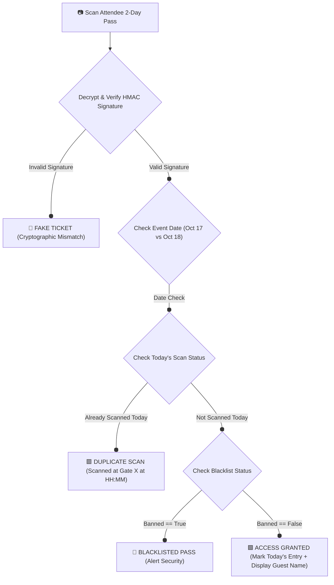

# 💃 RANGILO RAAS 2026 — 2-DAY SEASON PASS QR TICKET SCANNING SYSTEM
> **Official Operational & Technical Blueprint**  
> **Event Dates**: 17th – 18th October 2026 | **Venue**: Jodhpur, Rajasthan  
> **Prepared For**: Rangilo Raas Organizing Committee  
> **Ticketing Policy**: ALL PASSES ARE 2-DAY COMBO PASSES (Valid for Both Oct 17 & Oct 18. No Single-Day Passes Sold)  
> **System Stack**: Next.js 15, Supabase, Cryptographic Offline PWA Scanner Engine  

---

## 📌 Executive Summary

Rangilo Raas is a premier 2-day Garba festival in Jodhpur happening on **17th & 18th October 2026**. **All official tickets sold for the event are 2-Day Season Combo Passes** (covering entry for both October 17 and October 18). No single-day passes (Day 1 only / Day 2 only) are sold.

Our **Smart 2-Day QR Ticket Scanning Architecture** delivers:
- **One Master QR Pass per Attendee**: Each attendee receives 1 digital pass. Covers entry for Day 1 (Oct 17) and Day 2 (Oct 18) seamlessly.
- **Automatic Date-Aware Gate Logic**: Scanner devices enforce 1 entry per day (1 scan on **October 17** + 1 scan on **October 18**).
- **100% Offline-First Execution**: Scanning takes **< 50 milliseconds** per ticket without internet connection, preventing gate queues.
- **Real-Time Anti-Passback & Screenshot Defense**: Blocks duplicate entry attempts instantly across all gate scanners with exact gate timestamps.
- **Live Organizer Command Dashboard**: Real-time crowd count, VIP venue tracking, and gate throughput metrics.

---

## 🔄 1. 2-Day Combo Pass Architecture & Gate Logic

### Ticket Structure
- **Ticket Category**: **2-Day Combo Season Pass (`season_2day`)**
- **Validity**: Covers **1 Attendee** for **Night 1 (Oct 17)** AND **Night 2 (Oct 18)**.
- **Single-Day Tickets**: **NONE** (No Day 1 only or Day 2 only passes sold).

---

### 📊 Scan Resolution Decision Matrix

When an attendee presents their 2-Day Combo Pass at the gate, the scanner executes the following decision flow:

| Scan Date | Day 1 Scan Status | Day 2 Scan Status | Scanner Action | Guard UI Alert & Audio Chime |
| :--- | :--- | :--- | :--- | :--- |
| **Oct 17 (Day 1)** | Not Used | Not Used | **GRANT ENTRY** | 🟩 **GREEN**: Welcome [Guest Name] - Day 1 of 2 |
| **Oct 17 (Day 1)** | Already Used | Not Used | **REJECT (DUPLICATE)** | 🟥 **RED**: Scanned Today at 8:14 PM (Gate A) |
| **Oct 18 (Day 2)** | Used (Oct 17) | Not Used | **GRANT ENTRY** | 🟩 **GREEN**: Welcome [Guest Name] - Day 2 of 2 |
| **Oct 18 (Day 2)** | Used (Oct 17) | Already Used | **REJECT (DUPLICATE)** | 🟥 **RED**: Scanned Today at 7:50 PM (VIP Gate) |
| **Any Date** | Banned | Banned | **DENY (BLACKLIST)** | 🚨 **DARK RED**: Pass Blacklisted - Alert Security |

---

## 📱 2. Gate Security App & Scanner UX

The mobile scanner app runs directly on security staff smartphones/tablets via web browser / PWA mode with zero app store download required.



### Key UI Features for Gate Guards:
- **Big Color Feedback**: Full-screen flash (Green = Go, Red = Stop) for dark Garba venue lighting.
- **Clear Date Indicator**: Displays **"DAY 1 ENTRY"** on Oct 17 and **"DAY 2 ENTRY"** on Oct 18.
- **Audio Chimes**: Distinct high-pitch double beep for entry success, loud buzzer for duplicate/invalid.
- **Guest Verification Card**: Displays **Guest Name**, **Category (VIP / General)**, and **Ticket ID** for quick spot-checks.

---

## 📶 3. Network Congestion & Offline-First Technology

During peak Garba hours (8:00 PM – 10:30 PM), mobile networks (Jio / Airtel / Vi) at event grounds in Jodhpur often face extreme slowdowns. 

### How Our Offline Engine Prevents Gate Backlogs:
1. **Pre-Fetch Sync**: Prior to opening gates (e.g., 5:00 PM), scanner devices tap **"Download Offline Database"**. All valid 2-day QR tokens and guest details are stored locally in the device's **IndexedDB**.
2. **Instant Local Scans**: The scanner validates HMAC digital signatures and checks local DB state in **< 50 milliseconds**, even in airplane mode.
3. **Background Multi-Gate Sync**: Scanners queue check-in timestamps locally. Whenever internet flickers back or devices connect to a local Wi-Fi router, logs sync seamlessly with the central database.
4. **Race-Condition Protection**: If Gate 1 and Gate 2 scan the same ticket offline simultaneously, the next sync cycle detects the conflict and flags the duplicate scan in the master audit log.

---

## 🛡️ 4. Anti-Fraud & Security Defenses

| Threat Model | Countermeasure / System Defense |
| :--- | :--- |
| **Screenshot & WhatsApp Sharing** | Once scanned, the ticket status updates globally across all devices within seconds. A shared screenshot used by a second person triggers **DUPLICATE SCAN ALERT**. |
| **Pass-Back (Handing QR back across fence)** | Instant timestamp registration. Re-scanning the same ticket within 5 minutes or at another gate triggers an immediate alarm. |
| **Fake Generated QR Codes** | QR codes use **HMAC-SHA256 Cryptographic Signatures**. A generated fake QR will fail signature validation instantly, throwing a **"FAKE TICKET"** warning. |

---

## 📊 5. Real-Time Organizer Dashboard

Event organizers access a live management portal with high-level control:

1. **Live Occupancy Count**: Total attendees checked in on Night 1 and Night 2.
2. **Day 1 vs Day 2 Attendance Ratio**: Track retention from Night 1 (Oct 17) to Night 2 (Oct 18).
3. **Gate Throughput Metrics**: See scans/minute per gate to reallocate security staff to congested queues.
4. **VIP Table Management**: Track VIP guest check-ins live to alert hospitality hosts.
5. **Instant Override**: Ability for admins to look up guests by phone/name if phone battery dies.

---

## 🗄️ 6. Database Schema Updates (`schema.sql`)

To enforce 2-day season combo passes, the database tracks separate check-in flags for Day 1 (Oct 17) and Day 2 (Oct 18):

```sql
-- Migration: Add 2-Day Season Pass Support for Rangilo Raas 2026 (Oct 17 & 18)

ALTER TABLE public.tickets 
ADD COLUMN IF NOT EXISTS valid_days TEXT NOT NULL DEFAULT 'both' 
    CHECK (valid_days IN ('both')),
ADD COLUMN IF NOT EXISTS day_1_scanned BOOLEAN NOT NULL DEFAULT FALSE,
ADD COLUMN IF NOT EXISTS day_1_scanned_at TIMESTAMPTZ,
ADD COLUMN IF NOT EXISTS day_2_scanned BOOLEAN NOT NULL DEFAULT FALSE,
ADD COLUMN IF NOT EXISTS day_2_scanned_at TIMESTAMPTZ;

-- Index for fast date-based scan queries
CREATE INDEX IF NOT EXISTS idx_tickets_day_1_scanned ON public.tickets(day_1_scanned);
CREATE INDEX IF NOT EXISTS idx_tickets_day_2_scanned ON public.tickets(day_2_scanned);
```

---

## 🚀 7. Event-Day Execution Timeline

```
OCTOBER 16 (Day -1): SYSTEM SETUP & DRILL
├── 04:00 PM: Configure Event Metadata (Title: Rangilo Raas, Dates: Oct 17-18)
├── 06:00 PM: Create Gate Staff Access PINs (Gate A: 1010, Gate B: 2020, VIP: 8888)
└── 08:00 PM: Perform mock scan test across security devices in offline mode

OCTOBER 17 (DAY 1 - GARBA NIGHT 1):
├── 05:30 PM: Security Staff log in & download Offline Ticket Manifest
├── 06:30 PM: Gates Open - System set to Day 1 Scanning Mode (Oct 17)
├── 08:30 PM: Peak Entry Hour - Scanners mark Day 1 attendance
└── 11:30 PM: Gates Close - Day 1 reconciliation sync & report export

OCTOBER 18 (DAY 2 - GRAND FINALE):
├── 05:30 PM: Security Staff update app to Day 2 Scanning Mode (Oct 18)
├── 06:30 PM: Gates Open - System set to Day 2 Scanning Mode
└── 11:30 PM: Event Conclusion - Final 2-day festival attendance report export
```

---

> [!NOTE]
> **Technical Assurance**: This system is architected for zero downtime, sub-second scanning speed, and complete immunity to event-ground network outages.
