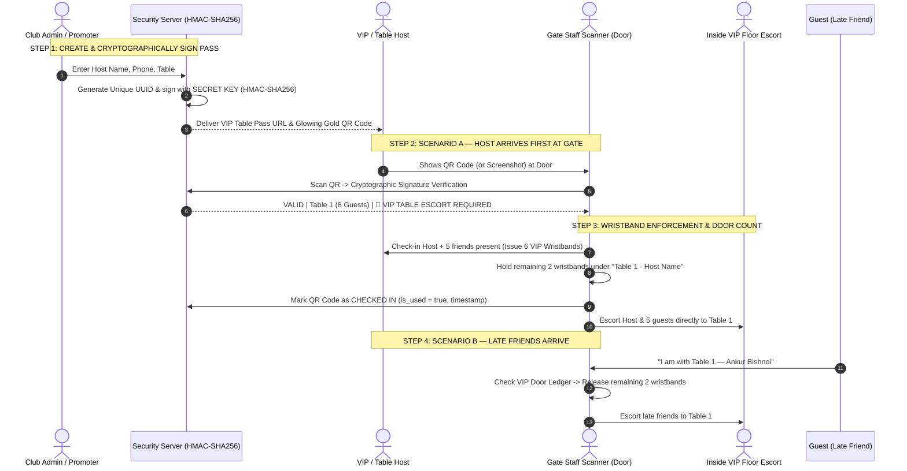

# CLUB NIRVANA // VIP TABLE OPERATIONS & GATE SECURITY GUIDE

This document serves as the operational manual and security architecture guide for the **Club Nirvana Event Ticketing & VIP Table Reservation System**.

---

## 1. System Overview

The Club Nirvana Ticketing System issues cryptographically signed QR Code passes for 5 core ticket categories:
1. **Regular** — General Admission
2. **Couple** — Two-person entry pass
3. **VIP Table** — Bottle service table reservations (`Small Table` 4 to 6 Guests, `Big Table` 8 to 10 Guests)
4. **Staff** — Working personnel credential
5. **Guest** — Complimentary VIP guest list

All QR passes are generated via the Admin Dashboard (`/admin`) and verified in real-time at the door using the Gate Staff Scanner (`/staff/dashboard`).

---

## 2. End-to-End Security Architecture & Flow

---

## 3. Loophole Defense Matrix

| Exploit Attempt | Can They Cheat? | How The System Defends Against It |
| :--- | :---: | :--- |
| **Fake QR Code Generator** | **BLOCKED ❌** | Every QR token contains a cryptographic HMAC-SHA256 signature (`qrCrypto.ts`). Any forged QR code fails signature verification immediately and triggers an alert. |
| **Screenshot Sharing / Double Entry** | **BLOCKED ❌** | The moment a pass is scanned, its database record is locked (`is_used = true`). Any attempt to scan the same QR code again displays **`ALREADY USED AT [TIME]`**. |
| **Multiple Passes on One Phone Number** | **SAFE ✅** | Each ticket receives a unique UUID (`ticketId`) and independent signature. A phone number can receive multiple passes, but each QR can only be scanned once. |
| **Table Capacity Exceeded** | **BLOCKED ❌** | When scanned, the scanner displays exact guest counts (e.g., `8 GUESTS`). Door staff issues only the exact number of wristbands authorized by the ticket type. |
| **Blacklisted / Banned Guest** | **BLOCKED ❌** | If a guest is flagged as banned in the Admin Console (`is_banned = true`), scanning their pass displays **`BANNED — ENTRY DENIED`**. |

---

## 4. VIP Table Booking Desk Operations (`/admin`)

1. Navigate to `https://club-nirvana.vercel.app/admin`.
2. Select the **`VIP TABLES`** top navigation tab.
3. Choose the package:
   - **Small Table**: ₹7,999 (₹2,500 Redeemable Cover Credit, 4 to 6 Guests)
   - **Big Table**: ₹11,999 (₹3,999 Redeemable Cover Credit, 8 to 10 Guests)
4. Enter **Table Number** (e.g. `Table 1`, `VIP Booth A`) and **Guest Count** (e.g. `6` or `10`).
5. Click **`GENERATE VIP TABLE PASS & QR`**.
6. Share the pass URL directly to the host via WhatsApp.
